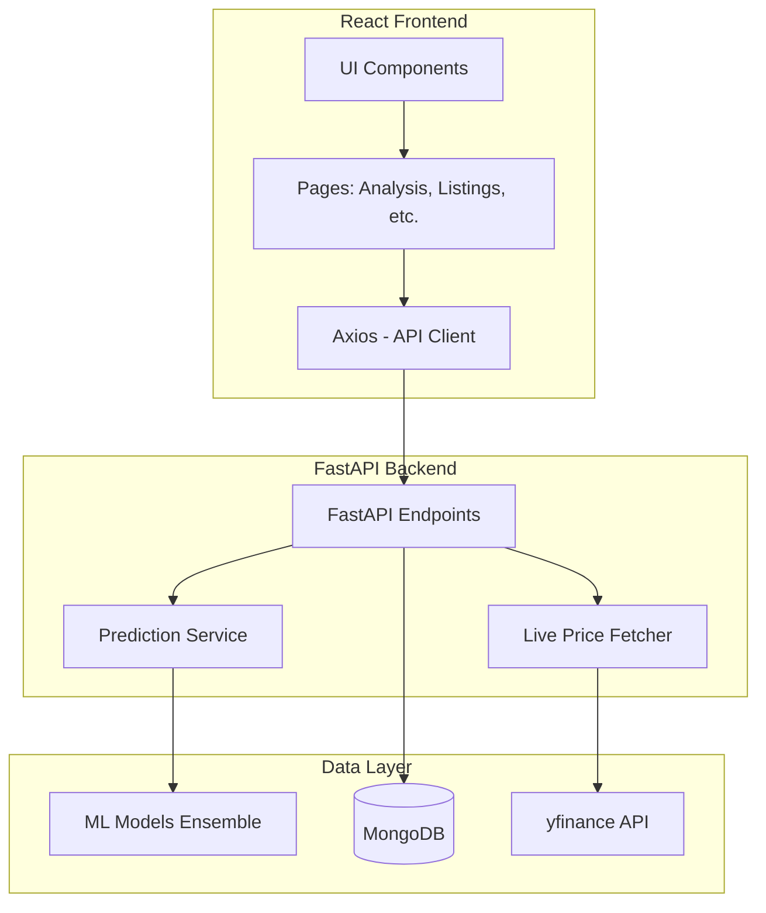

# StockTraQ: Technical Architecture Overview 🏗️

StockTraQ is an AI-driven IPO analysis platform that combines modern web technologies with advanced machine learning ensemble models to provide high-precision financial insights.

## 🏗️ System Architecture

The project follows a decoupled client-server architecture:



---

## 💻 Frontend Architecture (React + Vite)

Built with **React 18** and **Vite**, focusing on a premium, responsive "glassmorphic" design.

- **Routing**: Managed via `react-router-dom`.
- **State Management**: Local React hooks (`useState`, `useEffect`) for component-level state and interactive forms.
- **Key Pages**:
    - `Analysis.jsx`: Main interface for simulating/viewing IPO ratings. Triggers POST requests to `/analyze`.
    - `Listings.jsx`: Displays historical and ongoing IPOs from MongoDB.
    - `Home.jsx`: Entry point with project overview and feature highlights.
- **Styling**: Vanilla CSS for core layout with Tailwind CSS-like utility patterns and Framer Motion for smooth transitions.

---

## ⚙️ Backend Architecture (FastAPI)

Performance-focused Python backend providing RESTful endpoints.

- **API Engine**: FastAPI handles asynchronous requests and provides automatic OpenAPI documentation.
- **Service Layer**:
    - `backend/services/prediction_service.py`: Encapsulates all ML logic. Loads pickle models and executes the ensemble prediction.
    - `backend/database.py`: Manages connections to MongoDB.
- **Endpoints**:
    - `POST /analyze`: Receives IPO metrics, feeds them to the ML engine, and returns a unified 1-10 rating.
    - `GET /ongoing`: Fetches live IPOs from the database.
    - `GET /closed`: Retrieves historical IPO archives.

---

## 🧠 Machine Learning Engine (The Ensemble)

StockTraQ utilizes a 5-model ensemble strategy to ensure robust forecasting.

### 1. Model Components
The engine combines three algorithms: **Random Forest (40%)**, **Gradient Boosting (40%)**, and **Linear Regression (20%)**.

### 2. Specialized Trackers
- **Listing Gain Predictor**: Forecasts opening day performance.
- **Financial Strength Audit**: Scores fundamentals (Revenue, ROE, ROCE).
- **Valuation Impact**: Analyzes P/E metrics.
- **Long-Term Projection**: Estimates performance trends over 6-12 months.
- **Demand Tiering**: Classifies subscription interest (High/Medium/Low).

### 3. Unified TraQ Score (v2)
A weighted aggregation of all predictions into a single 1-10 score, providing internal consistency across different IPO sizes and sectors.

---

## 📊 Data Pipeline & Integration

- **Live Market Data**: Integrates `yfinance` via `live_price_fetcher.py` to get near real-time pricing for listed stocks.
- **Database**: MongoDB stores historical archives (2023-2025) and ongoing listing information.
- **Data Split**: Models are trained on 2023-2024 data and validated against high-volatility 2025 listings.

---

## 📂 Directory Structure

```text
/StockTraQ
├── backend/            # FastAPI source, models loader, and services
├── frontend/           # React source code (Vite-based)
├── models/             # Serialized ML models (.pkl files)
├── data/               # Raw and processed datasets
├── live_price_fetcher.py # Standalone market data utility
├── app.py              # Legacy Streamlit entry (kept for reference)
└── main.py             # Main FastAPI entry point (within /backend)
```

---
*Generated by Antigravity AI for StockTraQ Core.*
