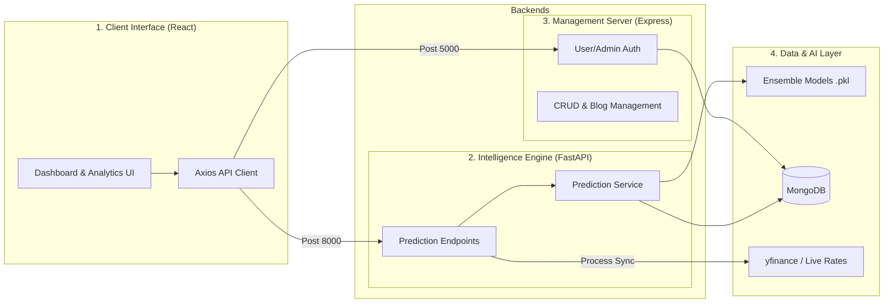

# StockTraQ: Technical Project Documentation

---

## 1. Project Overview
StockTraQ is an AI-powered Initial Public Offering (IPO) analysis platform. It aggregates historical data, subscription demand, and company financial health to generate a Unified Intelligence Rating (1-10) mapped for high-precision investment decision support.

The application follows a modern Decoupled Architecture separating the client application (React) from corresponding backend data engines (FastAPI and Node.js/Express).

---

## 2. System Architecture

The project utilizes a Distributed Microservices layer separating core responsibilities:



---

## 3. Technology Stack

| Layer | Technology | Technical Advantage |
| :--- | :--- | :--- |
| **Frontend** | React 18 + Vite | Virtual DOM, faster bundling algorithms, low memory footprints. |
| **Styles** | Vanilla CSS + Framer Motion | Frame-rate unblocked animations, Glassmorphism layouts. |
| **Backend 1** | FastAPI (Python 3.10+) | Asynchronous threading ideal for ML inference data streams. |
| **Backend 2** | Node.js (Express) | Unblocked I/O ideal for state scaling, dashboard operations. |
| **Database** | MongoDB | Document-layer scaling perfect for unformatted historic CSV aggregations. |
| **ML Models** | Scikit-Learn | Pickle serialization distributing pre-trained scoring streams. |

---

## 4. Project Directory Specification

An overview detailing responsibilities of core directory paths:

```text
/StockTraQ
├── backend/                  # Python FastAPI Engine 
│   ├── main.py               # REST endpoints, router fallbacks, isolation executers
│   ├── database.py           # MongoDB connector and query distribution
│   └── services/
│       └── prediction_service.py # Core ML loader managing serialized model loads
│
├── node-backend/             # Node.js Express Server
│   ├── server.js             # JWT handler, lock controller, router gates
│   └── models/               # Mongoose schemas (Admin, User, Blog, Ipo)
│
├── frontend/                 # React 18 Client structure
│   ├── src/
│   │   ├── components/       # Reusable Contexts (Analysis forms, live widgets)
│   │   └── pages/            # View managers (Listings, Auth grids)
│   │       └── admin/        # Secured Administrative Dashboards (Dashboard, Login)
│
├── models/ / models_v2/      # Serialized pickle arrays holding trained weights
├── live_price_fetcher.py     # Independent script pulling standalone pricing pipelines
└── run.bat                   # Composite launcher launching separated endpoints concurrently
```

---

## 5. Connections & Communication Protocols

*   **Decoupled querying**: The Frontend issues standard asynchronous `axios` queries differentiating base URLs based on operation type:
    *   *Port 8000*: Serves FastAPI Predictive weights and analytics.
    *   *Port 5000*: Targets Node.js Admin Dashboard and Auth locks.
*   **CORS implementation**: Enabled Cross-Origin controllers ensure browser security shields correctly pass requests between distinct server origins securely distributing fluid aggregates.

---

## 6. API Endpoint Specifications

### A. FastAPI (Intelligence Endpoints)
| Route | Method | Payload | Returns / Impact |
| :--- | :--- | :--- | :--- |
| `/analyze` | `POST` | Subscription stats, size, PE metrics | Aggregates full multi-target scaling distributing rating 1-10. |
| `/ongoing` | `GET` | Empty | Live feeds fetching concurrent active tickers. |
| `/closed` | `GET` | Empty | MongoDB archival list targeting older records. |
| `/api/model-metrics` | `GET` | Empty | Validation summaries (Accuracy, precision metrics). |

### B. Node.js (Management & Security Endpoints)
| Route | Method | Guarded? | Impact |
| :--- | :--- | :--- | :--- |
| `/admin/login` | `POST` | No | Signs JWT tokens validating administrative access. |
| `/api/register` | `POST` | No | Distributes standard user identity pipelines natively. |
| `/admin/add-ipo` | `POST` | Yes (JWT) | Secure database Insertion distribution locked via route auths. |
| `/admin/ipo/:id`| `DELETE`| Yes (JWT) | Protective deletion execution lock securing database updates. |
| `/admin/add-blog`| `POST` | Yes (JWT) | Inserts Blog metrics distributing markdown layouts natively. |
| `/admin/add-faq` | `POST` | Yes (JWT) | Appends support Live Query guides to secure pipeline locks. |
| `/api/live-rates`| `GET` | No | Executes children process spawning index aggregator utilities. |

---

## 7. Admin & Security Management

*   **JWT token verification**: Administrative endpoints lock critical state edits using signed bearer authorization headers securely verifying session keys strictly.
*   **Process Isolation**: Some data aggregators spawn synchronous locks; processes distribute operations through standard background script isolation safeguarding crashes.

---

## 8. Rationale Behind Technological Choices

The architectural choices underpinning StockTraQ are selected to optimize performance, schema flexibility, and maintainability:

### React + Vite (Frontend)
*   **Component Modularity**: Enables building plug-and-play Dashboard metric cards and reusable forms, keeping the structural code maintainable.
*   **Vite Compiler**: Provides instantaneous compilation rates compared to legacy loaders (like Webpack), rendering hot-module updates effortlessly for heavy interactive setups.

### FastAPI & Scikit-learn (ML Engine)
*   **Data Science Compatibility**: Python is the industry standard for executing Machine Learning matrix manipulations directly.
*   **Asynchronous Distribution**: FastAPI speeds exceed common Python frameworks (like Flask/Django), handling concurrent triggers reducing timeouts distributed for predictive streams loads natively.

### MongoDB (Database)
*   **Schema Flexibility**: Static SQL tables require strict migration structures each time fields change. MongoDB's NoSQL BSON layer accepts differing financial formats nicely ensuring unformatted archives remain fluid.

---

## 9. Rationale for Split-Backend Architecture

The incorporation of a Split Backend architecture (utilizing both FastAPI and Node.js/Express) offers several advantages based on computational specialization and system reliability:

1.  **Specialized Efficiency Execution**
    *   Python excels at data science computation but executes slower than Javascript over pure unblocked I/O reads.
    *   Node.js excels at unblocked event loops ideal for managing user sessions, CRUD inputs, and fast database fetches.
2.  **Performance Isolation & Fault Tolerance**
    *   Under heavy calculation loads on the machine learning endpoints (FastAPI), the management endpoints (Logins, Admin edits) on Node.js stay completely responsive and unhindered.
3.  **Encapsulation and Security**
    *   Updates touching User Authentication pipelines strictly avoid touching predictive mathematics controllers, safeguarding core rating thresholds against unrelated system crashes.

---
*Documented comprehensively for StockTraQ Core Submission.*
