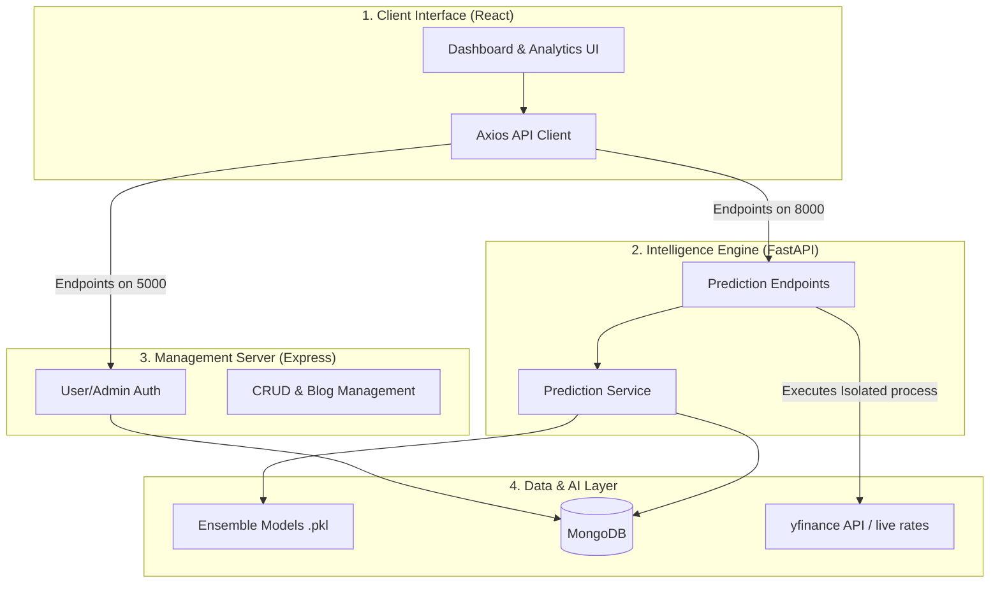

# 📊 StockTraQ: Complete Technical Project Documentation

---

## 📝 1. Project Overview
**StockTraQ** is an AI-powered Initial Public Offering (IPO) analysis platform. It aggregates historical data, subscription demand, and company financial health to generate a **Unified Intelligence Rating (1-10)** mapped for high-precision investment decision support.

The application follows a modern **Decoupled Client-Server Architecture** separating Intelligence (FastAPI), Management (Node.js/Express), and View templates (React).

---

## 🏗️ 2. System Architecture

The project utilizes a **Distributed Micro-services layer** mapping separated processes natively:



---

## 💻 3. Technology Stack

| Layer | Technology | Engineering Benefits |
| :--- | :--- | :--- |
| **Frontend** | React 18 + Vite | Virtual DOM, faster bundling, high responsive thresholds. |
| **Styles** | Vanilla CSS + Framer motion | Glassmorphism, smooth loading transitions, zero-bloat. |
| **Backend 1** | FastAPI (Python 3.10+) | Asynchronous concurrent threading ideal for math modeling data pipelines. |
| **Backend 2** | Node.js (Express) | Unblocked I/O ideal for dashboard edits, management concurrency streams. |
| **Database** | MongoDB | Document-layer scaling perfect for unformatted historic CSV aggregations. |
| **ML Models** | Scikit-Learn | Pickle serialization distributing pre-trained neural scoring streams. |

---

## 📂 4. Project Directory Specification

A clean overview describing responsibilities of crucial endpoints:

```text
/StockTraQ
├── backend/                  # Python FastAPI Server 
│   ├── main.py               # REST endpoints, router fallbacks, isolation executers
│   ├── database.py           # MongoDB connector and query distribution
│   └── services/
│       └── prediction_service.py # Core ML class loader loading serialized pickles
│
├── node-backend/             # Node.js Express Server
│   ├── server.js             # Security controller, JWT handler, router gates
│   └── models/               # Mongoose schema setups (Admin, User, Blog, Ipo)
│
├── frontend/                 # React 18 structure
│   ├── src/
│   │   ├── components/       # Reusable Contexts (Analysis forms, live widgets)
│   │   └── pages/            # View managers (Dashboard, Listings, Auth grids)
│
├── models/ / models_v2/      # Serialized pickle arrays holding weights
├── live_price_fetcher.py     # Isolated utility pulling standalone pricing pipelines
└── run.bat                   # Composite launcher launching separated endpoints concurrently
```

---

## 🔌 5. Connections & Cross-Origin flows

A standalone Frontend layer demands correct endpoints to separated servers:
*   **Decoupled querying**: Client issues standard `axios` queries differentiating base URLs:
    *   *Port 8000*: Direct routes serving FastAPI Predictive weights.
    *   *Port 5000*: Direct routes targeting Node.js Admin locks.
*   **CORS implementation**: Enabled controllers ensure browser security shields do not lock API payloads distributing fluid state aggregates between differing origins concurrently.

---

## 🌐 6. API Endpoint Specifications

### 🧠 A. FastAPI (Intelligence Endpoints)
| Route | Method | Payload | Returns / Impact |
| :--- | :--- | :--- | :--- |
| `/analyze` | `POST` | Subscription details, size, PE financials | Aggregates full multi-target scaling distributing rating 1-10. |
| `/ongoing` | `GET` | *Empty* | Live feeds fetching concurrent active tickers. |
| `/closed` | `GET` | *Empty* | MongoDB archival list targeting older records. |
| `/api/model-metrics` | `GET` | *Empty* | Validation summaries (Accuracy, precision metrics). |

### 🔐 B. Node.js (Management & Security Endpoints)
| Route | Method | Guarded? | Impact |
| :--- | :--- | :--- | :--- |
| `/admin/login` | `POST` | ❌ | Signs JWT tokens validating active administrative access. |
| `/api/register` | `POST` | ❌ | Distributes standard user identity pipelines natively. |
| `/admin/add-ipo` | `POST` | 🔑 (JWT) | Safe database Insertion distribution locked via route auths. |
| `/admin/ipo/:id`| `DELETE`| 🔑 (JWT) | Protective deletion execution safeguard locking database updates. |
| `/api/live-rates`| `GET` | ❌ | Executes background child process spawning index aggregator utilities. |

---

## 🛡️ 7. Admin & Security Management

*   **JWT Handle**: Administrative endpoints lock critical state edits distribute using local bearer authorizations securely verifying payloads distributing session keys strictly.
*   **Process Isolation**: Static asset updates sometimes spawn concurrent blocking timeouts; setups distribute operations through standard background script isolation safeguarding crashes.

---

## 💡 8. Rationale Behind Tech Stack Choices

Why were these specific technologies selected for StockTraQ?

### ⚛️ **React + Vite (Frontend)**
*   **Component-Based View Reuse**: React allows building responsive Dashboard metric cards and reusable forms, keeping structural code modular and maintainable.
*   **Vite Compiler**: Replaces legacy loaders (like Webpack). It provides near-instantaneous compilation rates distributing hot module updates effortlessly creating efficient local setups.

### 🐍 **FastAPI & Scikit-learn (ML Engine Core)**
*   **Native Matrix Handling support**: Python is the absolute industry standard for executing Machine Learning matrix manipulations directly.
*   **Asynchronous Distribution**: FastAPI speeds exceeding common Python frameworks (like Flask/Django). It handles IO-bound triggers effortlessly reducing blocking timeouts distributing predictive streams concurrent loads natively.

### 🍃 **MongoDB (Database Layer)**
*   **Fluid Dynamic Aggregates sizing**: Static SQL tables require strict migration schemas each time static fields change. MongoDB's NoSQL BSON layer accepts differing financial layouts nicely ensuring unformatted archives remain flexible.

---

## 🔥 9. Why Two Backends? (Hybrid Microservices Design)

You might be asked during defense reviews why there are two server layers (FastAPI + Node). Having a **Split Backend architecture** provides distinct advantages:

1.  **Specialized Efficiency execution**
    *   *Python* excels at data science and execution logic triggers but executes slower than Javascript layers over pure unblocked I/O reads.
    *   *Node.js* excels at handling user authorization, CRUD inputs, and fast database distrib feeds effortlessly.
2.  **Performance Isolation Strategy**
    *   If 1,000 users invoke highly-demanding Machine Learning predictions over FastAPI, your static static endpoints distribution (Logging In, Adding Admin posts) on Node.js stays completely responsive.
3.  **Modular maintainability**
    *   Updates touching User Authentication pipelines strictly avoid touching Predictive mathematics controllers, safeguarding core rating thresholds against unrelated crashes safely.

---
*Documented comprehensively for StockTraQ Core Submission.*
