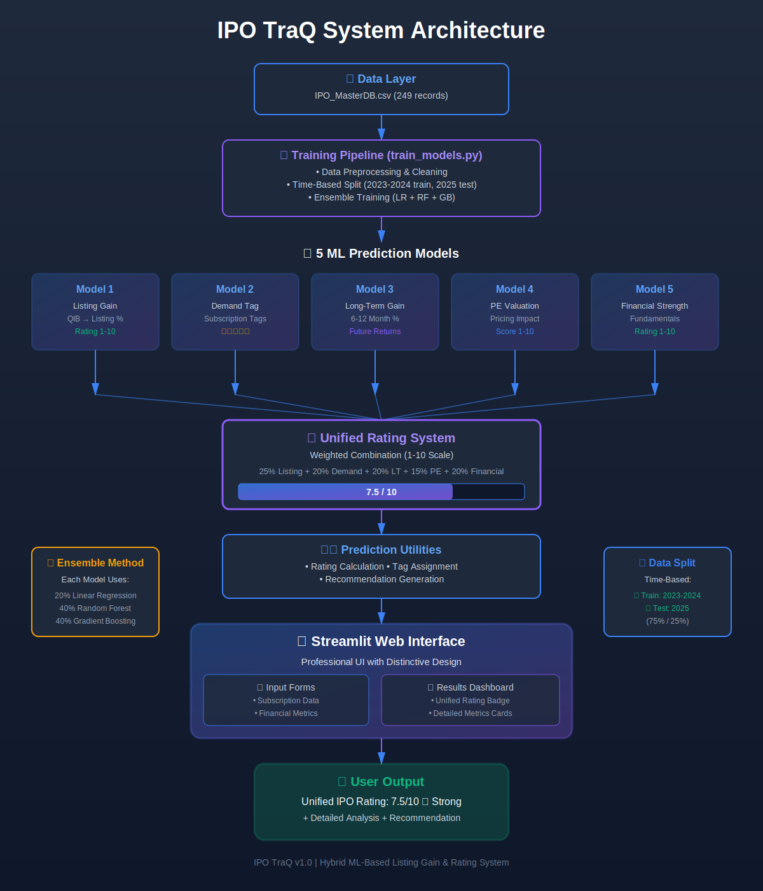

# Stock TraQ 📈
**AI-powered IPO Analysis & Archive Engine**

Stock TraQ is a professional-grade platform designed to provide deep insights into IPO performance. It leverages advanced machine learning models to predict listing gains and audit financial health, while maintaining a comprehensive archive of over 850+ historical IPOs from 2023 to 2025.



## 🚀 Key Features

- **Unified IPO Rating**: A hybrid 1-10 score generated by 5 specialized ML models.
- **Archive Explorer**: Interactive search and audit for 850+ historical listings.
- **AI Performance Audit**: Real-time backtesting comparing AI predictions vs. actual historical gains.
- **Neural Engine**: Combines Random Forest, Gradient Boosting, and Linear Regression for high-precision forecasting.
- **Premium Interface**: A glassmorphic, responsive UI built for modern financial intelligence terminals.

## 🛠️ Technology Stack

- **Frontend**: React 18 (Vite), Tailwind CSS, Lucide Icons, Framer Motion.
- **Backend**: FastAPI (Python 3.10+), Pydantic, Scikit-learn.
- **Database**: MongoDB (Archival data for 2023-2025).
- **Machine Learning**: Random Forest, Gradient Boosting (Ensemble).

## 📊 AI Prediction Models

Stock TraQ uses a multi-dimensional approach to IPO auditing:

1. **Listing Gain Predictor**: Forecasts opening day performance based on subscription tiers (QIB, NII, Retail).
2. **Financial Strength Audit**: Scores company fundamentals using Revenue, PAT, ROE, and ROCE metrics.
3. **Valuation Impact**: Analyzes pricing efficiency relative to P/E ratios and sector trends.
4. **Demand Tier Classification**: Categorizes market interest from 'Low' to 'Blockbuster'.
5. **Long-Term Projection**: Estimates performance trends over a 6-12 month horizon.

## ⚙️ Getting Started

### Prerequisites

- Node.js (v16+)
- Python (v3.9+)
- MongoDB (Running locally on `mongodb://localhost:27017`)

### 1. Database Setup
Ensure your MongoDB is running and contains the `stocktraq` database with the `master_db`, `ongoing_ipos`, and `closed_ipos` collections.

### 2. Backend Setup
```bash
cd backend
python -m venv .venv
source .venv/bin/activate  # or .venv\Scripts\activate on Windows
pip install -r requirements.txt
python main.py
```

### 3. Frontend Setup
```bash
cd frontend
npm install
npm run dev
```

### 4. Running the Complete App
Use the provided batch script for a quick start:
```bash
.\run.bat
```

## 📈 Methodology

Stock TraQ utilizes a time-based data split to simulate real-world forecasting:
- **Training Set**: Historical IPO data from 2023-2024.
- **Validation Set**: High-volatility listings from 2025.
- **Ensemble Weights**: 40% Random Forest, 40% Gradient Boosting, 20% Linear Regression.

## 📝 Disclaimer

*Investment Disclaimer: Stock TraQ provides AI-based predictions for educational and research purposes only. IPO investments carry significant market risk. Predictions and ratings should not be considered financial advice. Always consult with a certified financial advisor before making investment decisions.*

---

Built with ❤️ for Modern Investors.
